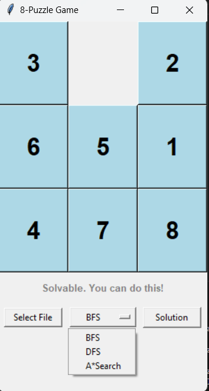
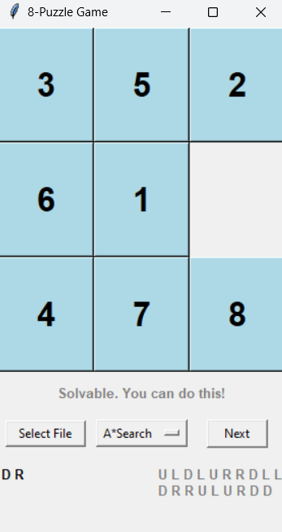

# 8-puzzle game

A simple playable game interface for the 8-puzzle game. Has the option to automatically solve the puzzle using Depth-first search (DFS), breadth-first search (BFS), or A\* search, depending on which the player opts to.

Note: to run, add the input puzzle in the command (ex. python main.py < puzzle.in)

#### Sample Screenshots

 
